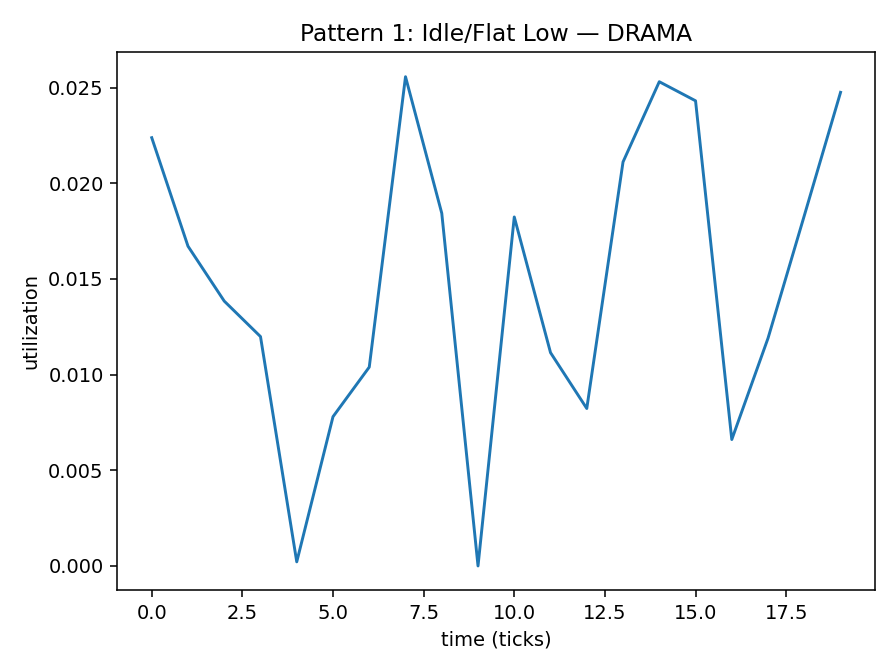

# Pattern 1 — Idle / Flat Low

**Config:** `N=20`, `NOISE=0.01`, `ALPHA=0.095238`  
(ALPHA auto-derived = `True`; rule: α ≈ 2/(N+1))

## Plots

## Window Statistics (per metric)
Metric | mean | median | p95 | p99 | EMA_last | CV | MAD | slope
---|---:|---:|---:|---:|---:|---:|---:|---:
SMACT | 0.0183 | 0.0177 | 0.0353 | 0.0357 | 0.0165 | 0.5117 | 0.0070 | -0.0010
SMOCC | 0.0084 | 0.0074 | 0.0248 | 0.0278 | 0.0100 | 0.9639 | 0.0055 | -0.0002
DRAMA | 0.0149 | 0.0153 | 0.0253 | 0.0255 | 0.0169 | 0.5201 | 0.0064 | 0.0003

Per-metric trend flags: SMACT=0 • SMOCC=0 • DRAMA=0

## Per-Metric Risk
Weights: wT=0.5, wE=0.3, wB=0.1, wC=0.1

Metric | T (p95) | E (EMA) | B (CV) | C (trend) | RISK
---|---:|---:|---:|---:|---:
SMACT | 0.0353 | 0.0165 | 0.5117 | 0.0 | 0.0737
SMOCC | 0.0248 | 0.0100 | 0.9639 | 0.0 | 0.1118
DRAMA | 0.0253 | 0.0169 | 0.5201 | 0.0 | 0.0697
