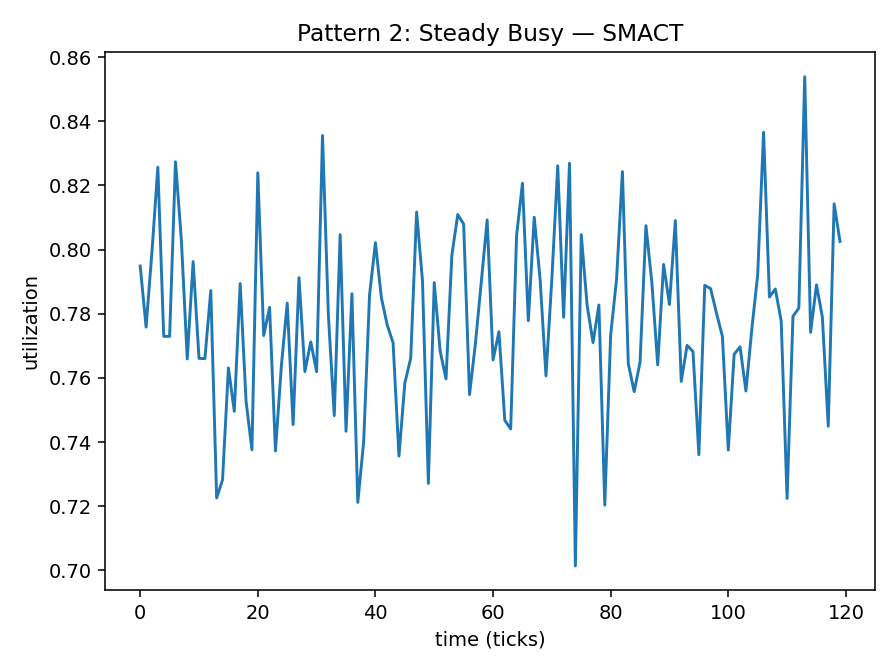
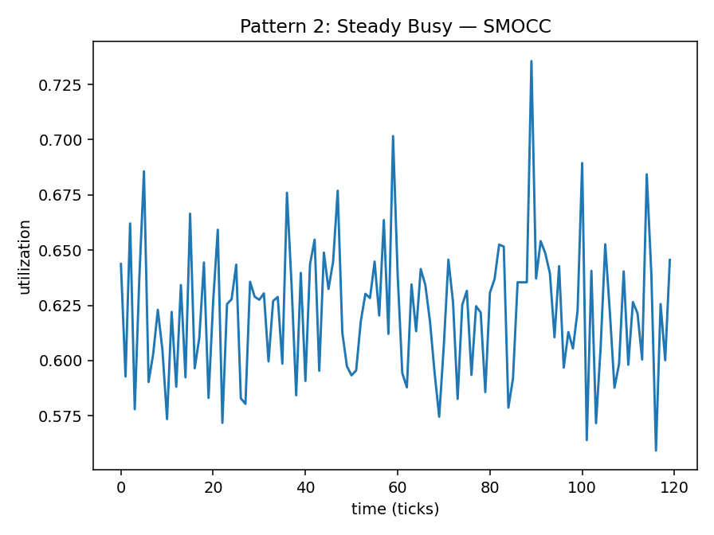
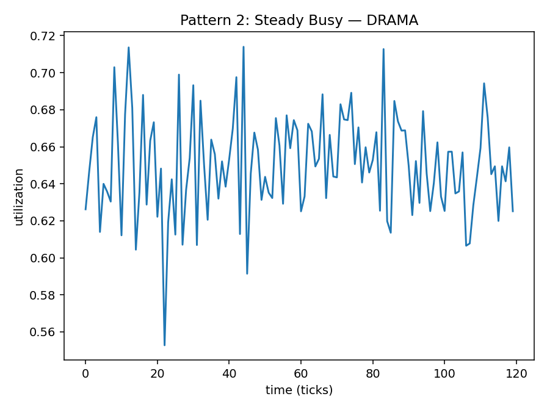

# Pattern 2 — Steady Busy

**Config:** `N=120`, `ALPHA=0.016529` (auto-derived=`True`)  
Levels (means): SMACT=0.78 • SMOCC=0.62 • DRAMA=0.65  
Noise (std): SMACT=0.03 • SMOCC=0.03 • DRAMA=0.03

## Plots

## Window Statistics (per metric)
Metric | mean | median | p95 | p99 | EMA_last | CV | MAD | slope
---|---:|---:|---:|---:|---:|---:|---:|---:
SMACT | 0.7776 | 0.7778 | 0.8257 | 0.8364 | 0.7812 | 0.0355 | 0.0145 | 0.0001
SMOCC | 0.6222 | 0.6256 | 0.6760 | 0.6993 | 0.6254 | 0.0486 | 0.0199 | 0.0000
DRAMA | 0.6503 | 0.6495 | 0.6944 | 0.7135 | 0.6466 | 0.0418 | 0.0192 | -0.0000

Trend flags: SMACT=0 • SMOCC=0 • DRAMA=0

## Per-Metric Risk (no mixing)
Weights: wT=0.5, wE=0.3, wB=0.1, wC=0.1

Metric | T (p95) | E (EMA) | B (CV) | C (trend) | RISK
---|---:|---:|---:|---:|---:
SMACT | 0.8257 | 0.7812 | 0.0355 | 0.0 | 0.6508
SMOCC | 0.6760 | 0.6254 | 0.0486 | 0.0 | 0.5305
DRAMA | 0.6944 | 0.6466 | 0.0418 | 0.0 | 0.5454
