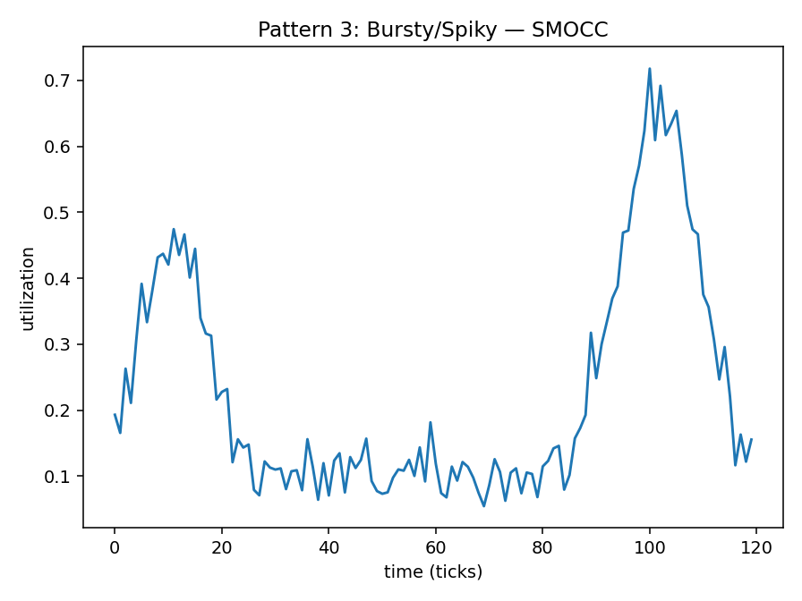

# Pattern 3 — Bursty / Spiky

**Config:** `N=120`, `ALPHA=0.016529` (auto-derived=`True`)  
Baselines: SMACT=0.15 • SMOCC=0.1 • DRAMA=0.12  
Noise std: SMACT=0.03 • SMOCC=0.03 • DRAMA=0.03  
Bursts (λ): SMACT=2.0 • SMOCC=2.0 • DRAMA=2.0

## Plots

## Window Statistics (per metric)
Metric | mean | median | p95 | p99 | EMA_last | CV | MAD | slope
---|---:|---:|---:|---:|---:|---:|---:|---:
SMACT | 0.4981 | 0.5374 | 0.8133 | 0.8708 | 0.4486 | 0.4394 | 0.1924 | 0.0003
SMOCC | 0.2306 | 0.1448 | 0.6096 | 0.6844 | 0.2544 | 0.7436 | 0.0668 | 0.0011
DRAMA | 0.3696 | 0.3058 | 0.7833 | 0.8247 | 0.3717 | 0.6208 | 0.1752 | 0.0013

Trend flags: SMACT=0 • SMOCC=0 • DRAMA=0

## Per-Metric Risk (no mixing)
Weights: wT=0.5, wE=0.3, wB=0.1, wC=0.1

Metric | T (p95) | E (EMA) | B (CV) | C (trend) | RISK
---|---:|---:|---:|---:|---:
SMACT | 0.8133 | 0.4486 | 0.4394 | 0.0 | 0.5852
SMOCC | 0.6096 | 0.2544 | 0.7436 | 0.0 | 0.4555
DRAMA | 0.7833 | 0.3717 | 0.6208 | 0.0 | 0.5653
