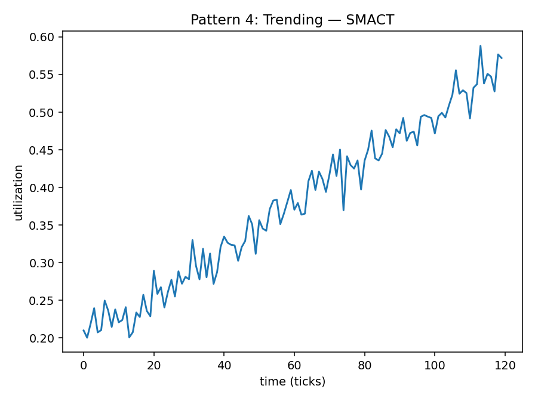
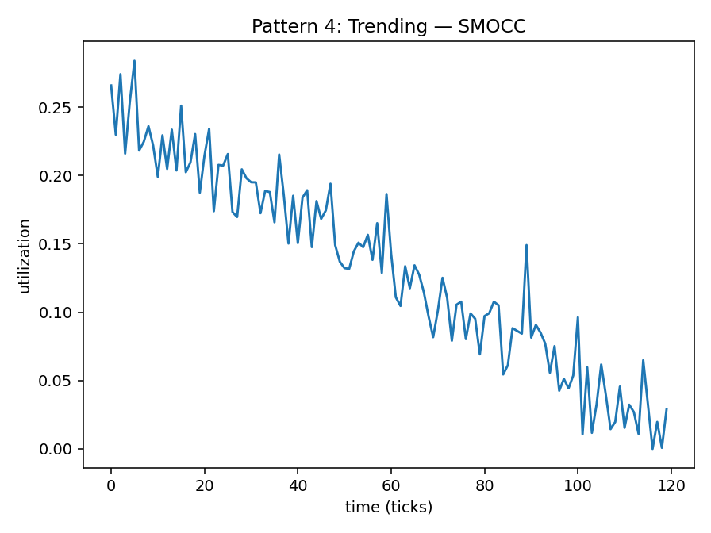
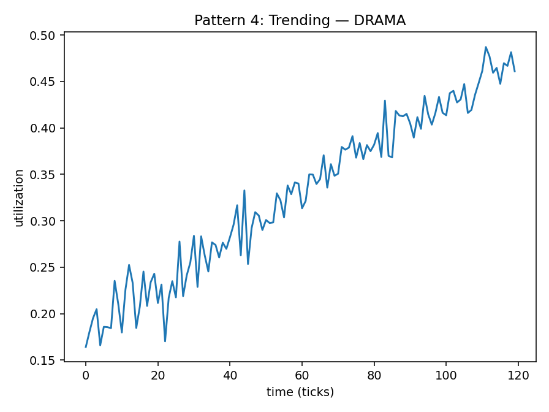

# Pattern 4 — Trending (Up/Down)

**Config:** `N=120`, `ALPHA=0.016529` (auto-derived=`True`)

Trends:
- SMACT: base=0.2, slope=0.003, piecewise=False, change_at=60, slope2=-0.002
- SMOCC: base=0.25, slope=-0.002, piecewise=False, change_at=60, slope2=0.003
- DRAMA: base=0.18, slope=0.0025, piecewise=False, change_at=60, slope2=-0.002

Noise std: SMACT=0.02 • SMOCC=0.02 • DRAMA=0.02
Clip: [0.0, 1.0]

## Plots

## Window Statistics (per metric)
Metric | mean | median | p95 | p99 | EMA_last | CV | MAD | slope
---|---:|---:|---:|---:|---:|---:|---:|---:
SMACT | 0.3769 | 0.3753 | 0.5386 | 0.5759 | 0.4039 | 0.2837 | 0.0966 | 0.0030
SMOCC | 0.1327 | 0.1340 | 0.2342 | 0.2725 | 0.1186 | 0.5350 | 0.0550 | -0.0020
DRAMA | 0.3289 | 0.3368 | 0.4614 | 0.4806 | 0.3469 | 0.2689 | 0.0766 | 0.0025

Trend flags: SMACT=1 • SMOCC=0 • DRAMA=1

## Per-Metric Risk (no mixing)
Weights: wT=0.5, wE=0.3, wB=0.1, wC=0.1

Metric | T (p95) | E (EMA) | B (CV) | C (trend) | RISK
---|---:|---:|---:|---:|---:
SMACT | 0.5386 | 0.4039 | 0.2837 | 1.0 | 0.5188
SMOCC | 0.2342 | 0.1186 | 0.5350 | 0.0 | 0.2062
DRAMA | 0.4614 | 0.3469 | 0.2689 | 1.0 | 0.4617
