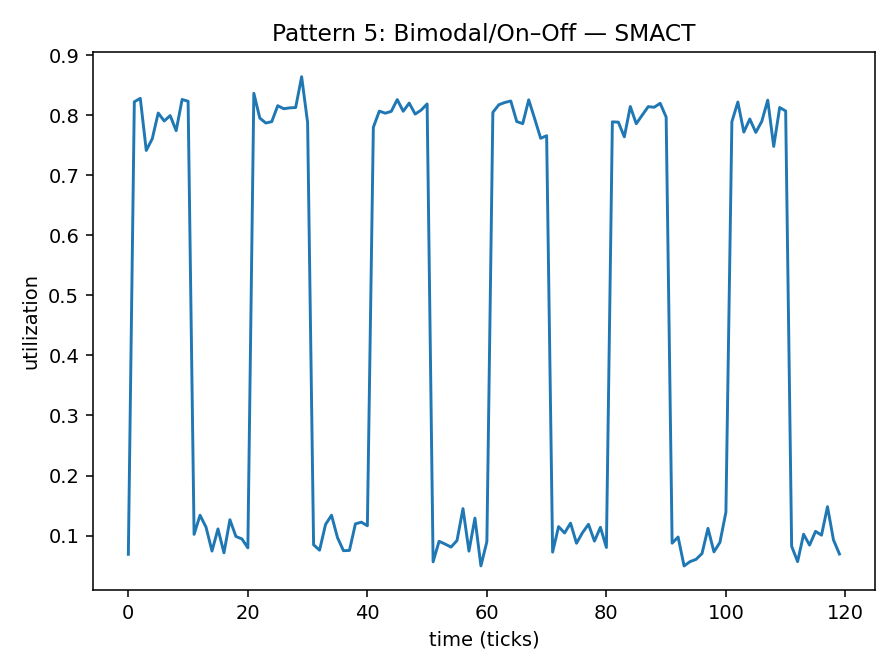
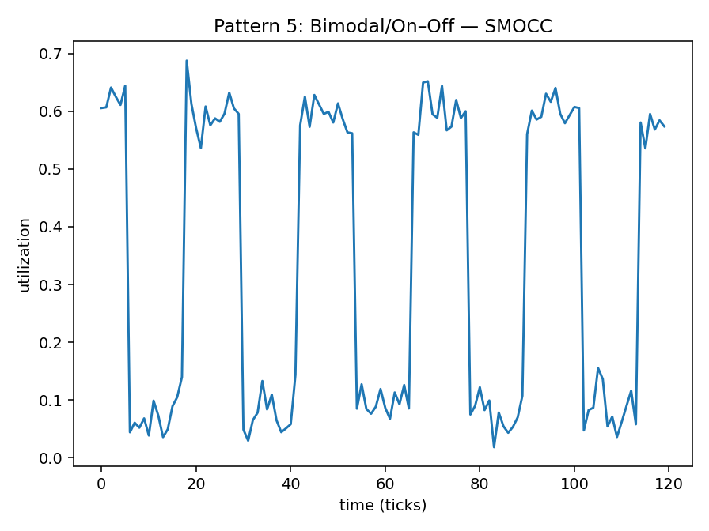
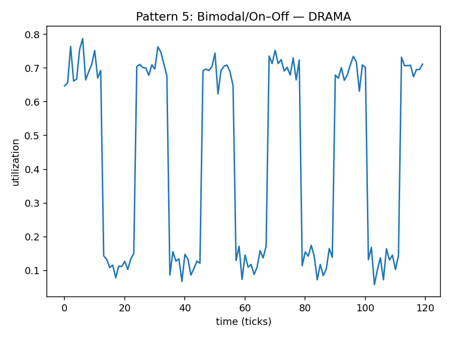

# Pattern 5 — Bimodal / On–Off

**Config:** `N=120`, `ALPHA=0.016529` (auto-derived=`True`)

Bimodal:
- SMACT: low=0.1, high=0.8, period=20, duty=0.5, jitter=0, random_phase=True
- SMOCC: low=0.08, high=0.6, period=24, duty=0.5, jitter=0, random_phase=True
- DRAMA: low=0.12, high=0.7, period=22, duty=0.5, jitter=0, random_phase=True

Noise std: SMACT=0.03 • SMOCC=0.03 • DRAMA=0.03
Clip: [0.0, 1.0]

## Plots

## Window Statistics (per metric)
Metric | mean | median | p95 | p99 | EMA_last | CV | MAD | slope
---|---:|---:|---:|---:|---:|---:|---:|---:
SMACT | 0.4479 | 0.4448 | 0.8252 | 0.8351 | 0.3744 | 0.7908 | 0.3559 | -0.0013
SMOCC | 0.3390 | 0.3456 | 0.6402 | 0.6513 | 0.3749 | 0.7685 | 0.2595 | -0.0001
DRAMA | 0.4365 | 0.6587 | 0.7474 | 0.7637 | 0.4622 | 0.6628 | 0.0934 | -0.0005

Trend flags: SMACT=0 • SMOCC=0 • DRAMA=0

## Per-Metric Risk (no mixing)
Weights: wT=0.5, wE=0.3, wB=0.1, wC=0.1

Metric | T (p95) | E (EMA) | B (CV) | C (trend) | RISK
---|---:|---:|---:|---:|---:
SMACT | 0.8252 | 0.3744 | 0.7908 | 0.0 | 0.6040
SMOCC | 0.6402 | 0.3749 | 0.7685 | 0.0 | 0.5094
DRAMA | 0.7474 | 0.4622 | 0.6628 | 0.0 | 0.5787
