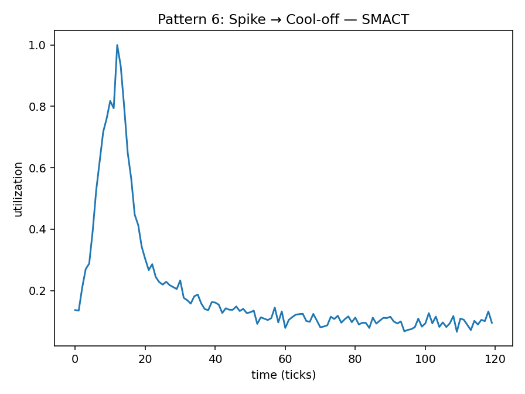
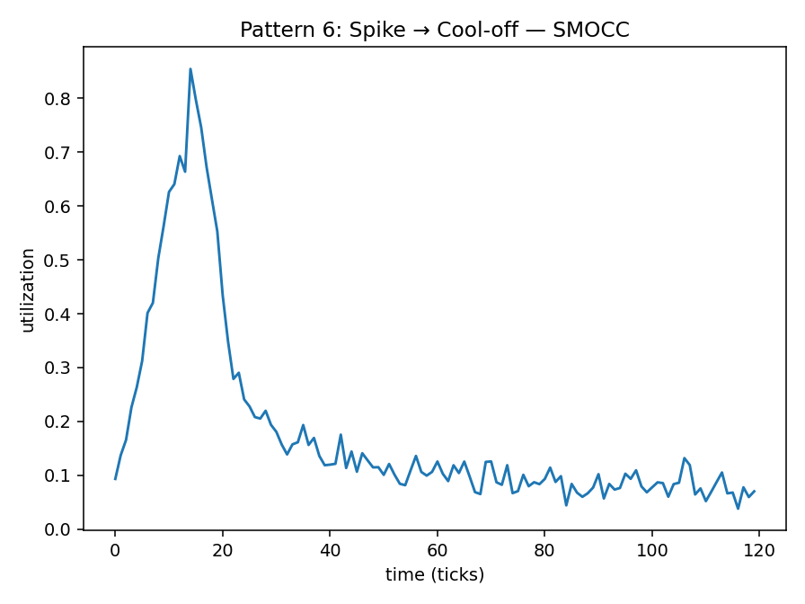
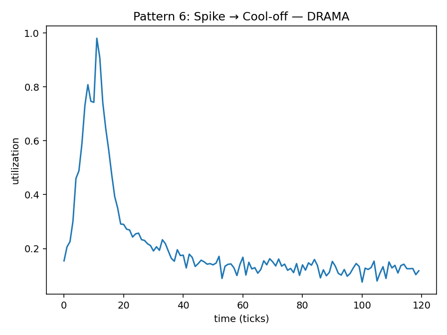

# Pattern 6 — Spike then Cool-off

**Config:** `N=120`, `ALPHA=0.016529` (auto-derived=`True`)

Spike model (per metric):
- SMACT: center=10, width=4.0, amp=0.7, tail_start=12, tau=15.0, tail_amp=0.3
- SMOCC: center=12, width=5.0, amp=0.6, tail_start=14, tau=18.0, tail_amp=0.25
- DRAMA: center=9, width=4.0, amp=0.65, tail_start=11, tau=16.0, tail_amp=0.28

Baselines: SMACT=0.1 • SMOCC=0.08 • DRAMA=0.12
Noise std: SMACT=0.02 • SMOCC=0.02 • DRAMA=0.02
Clip: [0.0, 1.0]

## Plots

## Window Statistics (per metric)
Metric | mean | median | p95 | p99 | EMA_last | CV | MAD | slope
---|---:|---:|---:|---:|---:|---:|---:|---:
SMACT | 0.1956 | 0.1200 | 0.7196 | 0.9099 | 0.1388 | 0.9816 | 0.0266 | -0.0035
SMOCC | 0.1801 | 0.1092 | 0.6417 | 0.7875 | 0.1200 | 0.9902 | 0.0318 | -0.0034
DRAMA | 0.2136 | 0.1440 | 0.7309 | 0.8892 | 0.1600 | 0.8410 | 0.0257 | -0.0033

Trend flags: SMACT=1 • SMOCC=1 • DRAMA=1

## Per-Metric Risk (no mixing)
Weights: wT=0.5, wE=0.3, wB=0.1, wC=0.1

Metric | T (p95) | E (EMA) | B (CV) | C (trend) | RISK
---|---:|---:|---:|---:|---:
SMACT | 0.7196 | 0.1388 | 0.9816 | 1.0 | 0.5996
SMOCC | 0.6417 | 0.1200 | 0.9902 | 1.0 | 0.5559
DRAMA | 0.7309 | 0.1600 | 0.8410 | 1.0 | 0.5976
