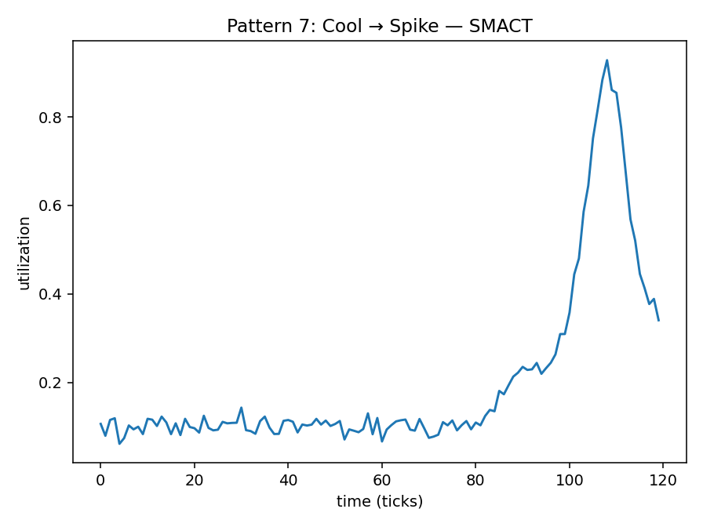

# Pattern 7 — Cool then Spike (late spike)

**Config:** `N=120`, `ALPHA=0.016529` (auto-derived=`True`)

Late-spike model (per metric):
- SMACT: start_at=80, tau=15.0, rise_amp=0.25, center=108, width=4.0, amp=0.6
- SMOCC: start_at=78, tau=18.0, rise_amp=0.2, center=106, width=5.0, amp=0.55
- DRAMA: start_at=82, tau=16.0, rise_amp=0.22, center=109, width=4.0, amp=0.58

Baselines: SMACT=0.1 • SMOCC=0.08 • DRAMA=0.12
Noise std: SMACT=0.02 • SMOCC=0.02 • DRAMA=0.02
Clip: [0.0, 1.0]

## Plots

## Window Statistics (per metric)
Metric | mean | median | p95 | p99 | EMA_last | CV | MAD | slope
---|---:|---:|---:|---:|---:|---:|---:|---:
SMACT | 0.2021 | 0.1120 | 0.7528 | 0.8791 | 0.2650 | 1.0019 | 0.0206 | 0.0039
SMOCC | 0.1787 | 0.0928 | 0.6693 | 0.8096 | 0.2332 | 1.0743 | 0.0290 | 0.0037
DRAMA | 0.2118 | 0.1295 | 0.7177 | 0.8640 | 0.2672 | 0.8953 | 0.0244 | 0.0036

Trend flags: SMACT=1 • SMOCC=1 • DRAMA=1

## Per-Metric Risk (no mixing)
Weights: wT=0.5, wE=0.3, wB=0.1, wC=0.1

Metric | T (p95) | E (EMA) | B (CV) | C (trend) | RISK
---|---:|---:|---:|---:|---:
SMACT | 0.7528 | 0.2650 | 1.0019 | 1.0 | 0.6561
SMOCC | 0.6693 | 0.2332 | 1.0743 | 1.0 | 0.6121
DRAMA | 0.7177 | 0.2672 | 0.8953 | 1.0 | 0.6285
